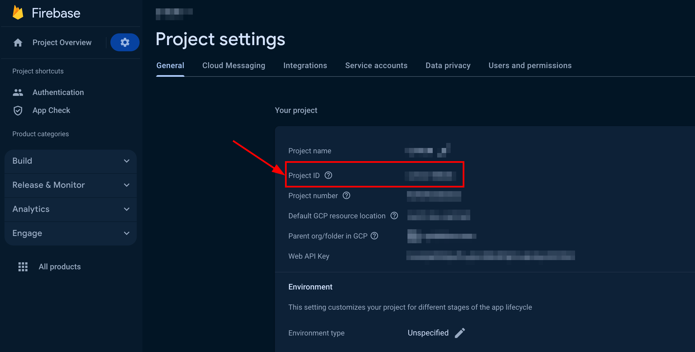
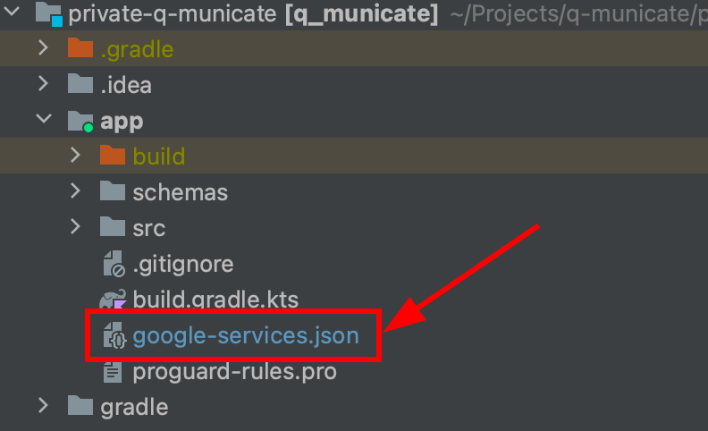
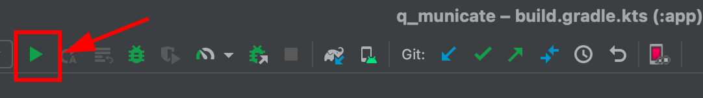

<div align="center">

<p>
		<a href="https://discord.gg/c6bxq9BC"></a>
</p>

</div>

# Before you begin

Register a new account following [this link](https://admin.quickblox.com/signup). Type in your email and password to
sign in. You can also sign in with your Google or Github accounts.
Create the app clicking New app button.
Configure the app. Type in the information about your organization into corresponding fields and click Add button.
Go to Dashboard => YOUR_APP => Overview section and copy your Application ID, Authorization Key, Authorization Secret,
and Account Key .

# To launch th Q-municate

To launch the project you need to take a few simple steps

## Step 1

1. Clone the repository using the link below:

```
    git clone https://github.com/QuickBlox/q-municate-android.git
```

2. Go to menu **File => Open Project**. (Or "Open an existing Project" if Android Studio is just opened)
3. Select a path to the Q-municate project.

## Step 2

Add the following properties to the **project-level local.properties** file

### 1. Keystore properties

These properties are needed so that you can sign your builds depending on the types you need to **debug** or **release**

```
#
### Debug keystore properties
debug_store_file=../keystore/debug.jks // the path where is the your debug key
debug_store_password= // debug store password for your key
debug_key_alias= // debug key alias for your key
debug_key_password= // debug key password for your key
#
### Release keystore properties
release_store_file=../keystore/release.jks // the path where is the your release key
release_store_password= // release store password for your key
release_key_alias= // release key alias for your key
release_key_password= // release key password for your key

```

### 2. Firebase properties

This application uses Firebase for authorization by phone number, therefore you need to specify the parameters required
for it. These properties can be found in **Project settings** particular project in the FireBase console
at [this link](https://console.firebase.google.com/). If you haven't already created a FireBase
project, [add Firebase to your Android project](https://firebase.google.com/docs/android/setup).
Information on how to enable phone number sign-in in Firebase you can find
by [this link](https://firebase.google.com/docs/auth/android/phone-auth#enable-phone-number-sign-in-for-your-firebase-project).

<p float="centr">

</p>

```
#
### Firebase properties
firebase_app_id="" // firebase app id
```

### 3. QuickBlox properties

These properties you need to init QuickBlox SDK.
How to get credentials is described in the [Before you begin](#before-you-begin) section.

```
#
### QuickBlox properties
quickblox_app_id="" // QuickBlox app_id your application
quickblox_auth_key="" // QuickBlox auth_key your application
quickblox_auth_secret="" // QuickBlox auth_secret your application
quickblox_account_key="" // QuickBlox account_key your application
quickblox_api_endpoint="" // QuickBlox api_endpoint your application
quickblox_chat_endpoint="" // QuickBlox chat_endpoint your application
```

### 4. QuickBlox AI properties

These properties need to use QuickBlox AI libraries. The QuickBlox AI libraries can be used with two different
approaches. Either directly, using the libraries with raw Open AI token, or with a QuickBlox session token via a proxy
server. We recommended using the proxy server method. Please ensure you use the latest method which you can check in
our [repository](https://github.com/QuickBlox/qb-ai-assistant-proxy-server).

```
#
### QuickBlox AI
quickblox_open_ai_token="" // your open ai token
quickblox_ai_proxy_server_url="" // proxy server URL
```

### Common example of completed properties

```
#
### Debug keystore properties
debug_store_file=../keystore/my-debug-key.jks 
debug_store_password=my-debug-store-password
debug_key_alias=my-debug-alias
debug_key_password=my-debug-key-password
#
### Release keystore properties
release_store_file=../keystore/my-release-key.jks 
release_store_password=my-release-store-password
release_key_alias=my-release-alias
release_key_password=my-release-key-password
#
### Firebase properties
firebase_app_id="my-firebase-app-123"
#
### QuickBlox properties
quickblox_app_id="67895"
quickblox_auth_key="lkjdueksu7392kj" 
quickblox_auth_secret="BTFsj7Rtt27DAmT" 
quickblox_account_key="9yvTe17TmjNPqDoYtfqp" 
quickblox_api_endpoint="api.endpoint.com"
quickblox_chat_endpoint="chat.endpoint.com" 
#
### QuickBlox AI
quickblox_open_ai_token="qwerty123qwedsfjHDSJHdjhqkldsqjdsaklja"
quickblox_ai_proxy_server_url="https://proxy.url"
#
### Terms of Service and Privacy Policy
tos_url="https://tos.url"
privacy_policy_url="https://privacy_policy.url"
```

## Step 3

For authorization to work correctly, you will need to add a configuration file for FireBase. Download the **google-services.json** file from **Project settings** your project in
the [FireBase console](https://console.firebase.google.com/) then add this file to the module (app-level) root directory
of your app. Detailed information can be found
at [this link](https://firebase.google.com/docs/android/setup#add-config-file).

<p float="centr">

</p>

## Step 4

After setting up all the properties and configurations described in the steps above, you can run the project. To do
this, you will need to connect a real Android device or emulator to Android Studio and then click the **Run** button.

<p float="centr">

</p>


## License

AIAnswerAssistant is released under the [MIT License](LICENSE.md).
